# Tempo Protocol

**Your AI-Powered DeFi & DePIN Platform for Cross-Chain Yield Optimization**

[](https://opensource.org/licenses/MIT)
[](https://www.typescriptlang.org/)
[](https://reactjs.org/)
[](https://wormhole.com/)

> **Democratizing DeFi through AI** - Tempo makes complex cross-chain DeFi strategies accessible to everyone through natural language interactions and intelligent automation.

---

## 📑 Table of Contents

- [What is Tempo?](#what-is-tempo)
- [Core Features](#core-features)
- [Architecture Overview](#architecture-overview)
- [Tech Stack](#tech-stack)
- [Getting Started](#getting-started)
- [Project Structure](#project-structure)
- [Implementation Status](#implementation-status)
- [Smart Contracts](#smart-contracts)
- [API Documentation](#api-documentation)
- [Key Features Explained](#key-features-explained)
- [Contributing](#contributing)
- [Security](#security)
- [Testing](#testing)
- [License](#license)
- [Connect With Us](#connect-with-us)

---

## 🌟 What is Tempo?

Tempo Protocol is an **AI-native DeFi platform** that bridges the gap between complex blockchain ecosystems and everyday users. We believe that accessing optimal yield strategies, moving assets across chains, and participating in decentralized infrastructure shouldn't require a PhD in cryptography.

### The Problem We Solve

- **Fragmented Liquidity:** Your assets are stuck on different chains with no easy way to move them
- **Complexity Barrier:** DeFi protocols are powerful but overwhelming for newcomers
- **Manual Optimization:** Finding the best yield requires constant research and monitoring
- **High Friction:** Moving between chains is expensive, slow, and error-prone

### Our Solution

Tempo brings together **AI-powered assistance**, **seamless cross-chain operations**, and **DePIN rewards** into one unified platform. Simply tell our AI what you want to achieve, and it handles the complexity for you.

### Who Is Tempo For?

- 🆕 **DeFi Newcomers** - Get started without technical knowledge
- 📊 **Experienced Traders** - Optimize strategies and save time
- 🏗️ **DePIN Operators** - Earn rewards and manage infrastructure
- 👨‍💻 **Developers** - Build on our APIs and integrate DeFi features

---

## ✨ Core Features

| Feature | Description |
|---------|-------------|
| 🤖 **AI Assistant** | Natural language DeFi interactions powered by multi-model LLMs (Gemini 2.5 & GPT-5) |
| 🌉 **Cross-Chain Bridge** | Seamless asset transfers across 12+ chains via Wormhole protocol with guardian verification |
| 💱 **Smart Swap** | Optimized token swaps with intelligent route finding and DEX aggregation |
| 📡 **DePIN Network** | Earn rewards from decentralized physical infrastructure - register devices and get paid |
| 📊 **Portfolio Tracker** | Real-time multi-chain asset monitoring with automatic balance aggregation |
| 🔐 **Multi-Wallet Support** | Connect EVM chains (Ethereum, Base, Arbitrum, Polygon, Optimism) + Solana |
| 📚 **Developer APIs** | RESTful APIs for integrating DeFi functionality into your applications |
| 🎨 **Beautiful UX** | Dark/light themes, 3D visualizations, and mobile-responsive design |

---

## 🏗️ Architecture Overview

### System Architecture


### AI Assistant Flow


### DePIN Reward Flow

```mermaid
graph LR
    A[📱 Register Device] --> B[📊 Generate Events]
    B --> C[💰 Accumulate Rewards]
    C --> D{Auto-Claim<br/>Threshold?}
    D -->|Reached| E[🌉 Cross-Chain Bridge]
    D -->|Not Yet| C
    E --> F[💸 Receive Sepolia ETH]
    F --> G[📈 Track in Portfolio]
    G --> H[🔄 Reinvest or Withdraw]
```



### Cross-Chain Bridge Process

```mermaid
sequenceDiagram
    participant User
    participant UI as Bridge Interface
    participant Wormhole as Wormhole SDK
    participant Guardians as Guardian Network<br/>(13/19 consensus)
    participant Source as Source Chain
    participant Target as Target Chain
    
    User->>UI: Select chains & token
    UI->>Wormhole: Calculate fees
    Wormhole-->>UI: Gas: $2.50, Bridge: $0.75
    UI-->>User: Show fee breakdown
    User->>UI: Confirm bridge (sign tx)
    UI->>Source: Lock tokens
    Source->>Wormhole: Emit transfer log
    Wormhole->>Guardians: Request VAA signature
    Guardians->>Guardians: Validate (13/19 signatures required)
    Guardians-->>Wormhole: VAA approved ✓
    Wormhole->>Target: Submit VAA
    Target->>Target: Mint wrapped tokens
    Target-->>User: Tokens received 🎉
    UI->>UI: Update transaction history
    UI-->>User: "Transfer complete!"
```



---

## 🛠️ Tech Stack

### Frontend Technologies
- **Framework:** React 18.3 with TypeScript 5.5
- **Build Tool:** Vite for lightning-fast development
- **Styling:** Tailwind CSS with custom design system
- **UI Components:** shadcn/ui (Radix UI primitives)
- **Animations:** Framer Motion for smooth transitions
- **3D Graphics:** Three.js + React Three Fiber for visualizations
- **Maps:** Google Maps API for DePIN device tracking

### State Management
- **Data Fetching:** TanStack Query (React Query) with optimistic updates
- **Global State:** React Context API
- **Persistence:** LocalStorage with automatic sync
- **Forms:** React Hook Form + Zod validation

### Web3 Integration
- **EVM Chains:** Wagmi 2.x + RainbowKit for wallet connections
- **Solana:** Solana Wallet Adapter
- **Cross-Chain Bridge:** Wormhole SDK v3.8+
- **Smart Contracts:** Ethers.js + Viem for contract interactions
- **Supported Networks:**
  - Ethereum Mainnet & Sepolia
  - Arbitrum, Optimism, Base
  - Polygon, BNB Chain, Avalanche
  - Fantom, Moonbeam, Aurora, Celo
  - Solana

### Backend Infrastructure
- **Database:** PostgreSQL with Row-Level Security (RLS)
- **Functions:** Edge Functions (Deno runtime) for serverless logic
- **Authentication:** JWT-based auth with wallet signature verification
- **Storage:** Secure file storage with access policies
- **Real-time:** WebSocket subscriptions for live updates

### AI/ML Integration
- **Models:** Multi-model support
  - Google Gemini 2.5 (Pro, Flash, Flash-Lite)
  - OpenAI GPT-5 (Standard, Mini, Nano)
- **Features:** 
  - Streaming responses for real-time interaction
  - Context-aware recommendations
  - Intent recognition and entity extraction
  - Multi-turn conversations with memory

### Development Tools
- **Package Manager:** npm
- **Linting:** ESLint with TypeScript rules
- **Type Safety:** Strict TypeScript configuration
- **Version Control:** Git with GitHub integration

---

## 🚀 Getting Started

### Prerequisites

Before you begin, ensure you have the following installed:

- ✅ **Node.js 18+** and npm (we recommend using [nvm](https://github.com/nvm-sh/nvm))
- ✅ **Git** for version control
- ✅ **Web3 Wallet** - MetaMask, Rainbow, Phantom, or any compatible wallet
- ✅ **(Optional)** Google Maps API key if you want to use DePIN mapping features

### Installation

```bash
# 1. Clone the repository
git clone https://github.com/yourusername/tempo-protocol.git
cd tempo-protocol

# 2. Install dependencies
npm install

# 3. Set up environment variables
cp .env.example .env

# 4. (Optional) Add your API keys to .env
# VITE_GOOGLE_MAPS_API_KEY=your_google_maps_key
# Note: Backend variables are auto-configured in production

# 5. Start the development server
npm run dev
```

The app will be available at `http://localhost:8080` (or the port shown in your terminal).

### Build for Production

```bash
# Create optimized production build
npm run build

# Preview production build locally
npm run preview
```

### Available Scripts

| Command | Description |
|---------|-------------|
| `npm run dev` | Start development server with hot reload |
| `npm run build` | Build optimized production bundle |
| `npm run preview` | Preview production build locally |
| `npm run lint` | Run ESLint to check code quality |

### Quick Start Guide

1. **Connect Your Wallet** - Click "Connect Wallet" in the top-right corner
2. **Try the AI Assistant** - Navigate to Chat and ask "What's the best yield for ETH?"
3. **Bridge Assets** - Go to Bridge to move tokens between chains
4. **Explore DePIN** - Visit the DePIN dashboard to register devices
5. **Check Your Portfolio** - View all your assets across chains in one place

---

## 📁 Project Structure

```
tempo-protocol/
├── src/
│   ├── components/              # React components
│   │   ├── bridge/             # Cross-chain bridge UI
│   │   │   ├── BridgeCard.tsx
│   │   │   ├── ChainSelector.tsx
│   │   │   ├── TokenSelector.tsx
│   │   │   └── WormholeConnectWidget.tsx
│   │   ├── chat/               # AI chat interface
│   │   │   ├── AIAssistantChat.tsx
│   │   │   ├── ChatInterface.tsx
│   │   │   └── MessageContent.tsx
│   │   ├── depin/              # DePIN dashboard & devices
│   │   │   ├── AddDeviceModal.tsx
│   │   │   ├── ClaimDashboard.tsx
│   │   │   ├── DeviceCard.tsx
│   │   │   └── Globe3D.tsx
│   │   ├── docs/               # Documentation components
│   │   │   ├── DocsSidebar.tsx
│   │   │   ├── CodeBlock.tsx
│   │   │   └── Mermaid.tsx
│   │   ├── portfolio/          # Asset tracking
│   │   │   ├── PortfolioOverview.tsx
│   │   │   └── AssetCard.tsx
│   │   └── ui/                 # Reusable UI components (shadcn)
│   │       ├── button.tsx
│   │       ├── card.tsx
│   │       ├── dialog.tsx
│   │       └── ...
│   ├── hooks/                  # Custom React hooks
│   │   ├── useUserProfile.ts   # User data management
│   │   ├── useTokenBalances.ts # Multi-chain balance fetching
│   │   ├── useWeb3Auth.ts      # Wallet authentication
│   │   └── useWormholeVAAPoller.ts # VAA polling
│   ├── pages/                  # Route pages
│   │   ├── Index.tsx           # Landing page
│   │   ├── Bridge.tsx          # Bridge interface
│   │   ├── Chat.tsx            # AI assistant
│   │   ├── DePIN.tsx           # DePIN dashboard
│   │   ├── Portfolio.tsx       # Asset overview
│   │   ├── Docs.tsx            # Documentation home
│   │   └── docs/               # API documentation pages
│   │       ├── AIAgentArchitecture.tsx
│   │       ├── BridgeGettingStarted.tsx
│   │       └── ...
│   ├── contracts/              # Smart contract ABIs & code
│   │   ├── TempoDePINFaucet.ts
│   │   └── TempoDePINFaucet_V2.sol
│   ├── lib/                    # Utility libraries
│   │   ├── protocols/          # DeFi protocol integrations
│   │   │   ├── aave.ts
│   │   │   ├── compound.ts
│   │   │   └── curve.ts
│   │   ├── contracts/          # Contract interaction helpers
│   │   └── utils.ts            # General utilities
│   ├── integrations/           # Third-party service integrations
│   │   └── supabase/           # Auto-generated Supabase types
│   ├── contexts/               # React Context providers
│   │   ├── ThemeContext.tsx
│   │   └── WalletContext.tsx
│   ├── utils/                  # Helper utilities
│   │   ├── wormholeScanAPI.ts
│   │   ├── etherscanPoller.ts
│   │   └── coingecko.ts
│   ├── index.css               # Global styles & design tokens
│   ├── main.tsx                # App entry point
│   └── App.tsx                 # Root component
├── supabase/
│   ├── functions/              # Backend edge functions
│   │   ├── ai-defi-assistant/  # AI chat endpoint
│   │   ├── user-profile/       # User CRUD operations
│   │   ├── user-wallets/       # Wallet management
│   │   ├── fetch-defi-yields/  # Yield aggregation
│   │   ├── fetch-token-prices/ # Price feeds
│   │   ├── estimate-bridge-fees/ # Fee calculation
│   │   ├── wormhole-portfolio-fetcher/ # Portfolio sync
│   │   ├── check-pending-rewards/ # DePIN rewards
│   │   ├── prepare-claim-funds/ # Claim preparation
│   │   └── transfer-reward-eth/ # ETH distribution
│   ├── migrations/             # Database schema migrations
│   └── config.toml             # Supabase configuration
├── public/                     # Static assets
│   ├── robots.txt
│   └── favicon.png
├── .env.example                # Environment variable template
├── tailwind.config.ts          # Tailwind configuration
├── vite.config.ts              # Vite configuration
├── tsconfig.json               # TypeScript configuration
└── package.json                # Dependencies & scripts
```

---

## 📊 Implementation Status

### ✅ Fully Implemented Features

- ✅ **Multi-Chain Wallet Connection** - EVM chains + Solana with RainbowKit & Wallet Adapter
- ✅ **AI Chat Assistant** - Streaming responses with context-aware recommendations
- ✅ **Cross-Chain Bridging** - Wormhole integration with VAA polling and transaction tracking
- ✅ **Token Swapping** - DEX aggregation with route optimization
- ✅ **DePIN Device Registration** - Add devices, track events, accumulate rewards
- ✅ **Reward Claiming System** - Cross-chain claims with automatic threshold detection
- ✅ **Real-Time Portfolio Tracking** - Multi-chain balance aggregation
- ✅ **User Profiles** - Preferences, settings, and activity history
- ✅ **Transaction History** - Complete audit trail with status tracking
- ✅ **Comprehensive Documentation** - Developer-friendly docs with code examples
- ✅ **Dark/Light Theme** - Persistent theme preferences
- ✅ **Mobile Responsive Design** - Optimized for all screen sizes
- ✅ **3D Visualizations** - Three.js powered globe for device mapping

### 🚧 In Active Development

- 🚧 **RESTful API Endpoints** - Public APIs for external integrations
- 🚧 **Advanced Yield Strategies** - Auto-compounding and multi-protocol optimization
- 🚧 **Automated Claim Triggers** - Smart threshold-based claiming
- 🚧 **Enhanced Analytics Dashboard** - Profit/loss tracking, performance metrics
- 🚧 **Multi-Signature Wallet Support** - Gnosis Safe integration
- 🚧 **Batch Transactions** - Bundle multiple operations for gas savings

### 📋 Roadmap (Q2-Q3 2025)

- 📋 **Mobile Native App** - React Native app for iOS and Android
- 📋 **Browser Extension** - Quick access to wallet and AI assistant
- 📋 **DAO Governance Module** - Community voting and proposals
- 📋 **Advanced Charting** - TradingView-style charts with technical indicators
- 📋 **Social Trading Features** - Copy trading, leaderboards, strategy sharing
- 📋 **Mainnet Deployment** - Launch on Ethereum mainnet (currently Sepolia testnet)
- 📋 **Additional Chain Integrations** - Cosmos, Polkadot, Near
- 📋 **Fiat On/Off Ramp** - Credit card and bank transfer support
- 📋 **NFT Bridge** - Cross-chain NFT transfers
- 📋 **Limit Orders** - Set price targets for automatic execution

---

## 📜 Smart Contracts

### TempoDePINFaucet V2

**Purpose:** Distribute DePIN device rewards as Sepolia ETH

**Network:** Ethereum Sepolia Testnet

**Key Features:**
- ✅ Multi-claim support (fixed critical bug from V1)
- ✅ Batch reward allocation for multiple users
- ✅ Emergency withdrawal function
- ✅ Event emission for off-chain tracking
- ✅ Owner-only administrative functions
- ✅ Reentrancy protection

**Security Measures:**
- Owner-only functions for sensitive operations
- ReentrancyGuard to prevent reentrancy attacks
- Input validation on all functions
- Event logging for transparency

**Deployment:**
For deployment instructions and testing procedures, see `DEPLOYMENT_INSTRUCTIONS.md`

**Contract Verification:**
All contracts are verified on Etherscan for transparency.

---

## 📚 API Documentation

The Tempo Protocol provides RESTful APIs for developers to integrate DeFi and DePIN functionality into their applications.

### ⚠️ Development Status

**The Tempo API is currently in active development.** Features, endpoints, and response formats may change. We recommend testing thoroughly and staying updated with our changelog for any breaking changes.

### 📖 Full Documentation

Complete API documentation is available at `/docs/api` when running the application.

### 🔑 Authentication

All API requests require a valid JWT token from the authentication system.

```bash
# Include the token in the Authorization header
Authorization: Bearer YOUR_JWT_TOKEN
```

### 🌐 Key Endpoints

#### User Management

```typescript
// Get user profile
GET /functions/v1/user-profile
Response: { id, username, email, preferences, stats }

// Update user profile
PUT /functions/v1/user-profile
Body: { username?, email?, preferences? }

// Get connected wallets
GET /functions/v1/user-wallets
Response: [{ address, chain, verified, primary }]

// Add wallet
POST /functions/v1/user-wallets
Body: { address, chain, signature }
```

#### DePIN Operations

```typescript
// Report device event
POST /functions/v1/report-device-event
Body: { deviceId, eventType, timestamp, metadata }

// Check pending rewards
GET /functions/v1/check-pending-rewards?userId={userId}
Response: { totalRewards, claimable, pendingClaims }

// Prepare claim
POST /functions/v1/prepare-claim-funds
Body: { userId, amount, targetChain }
```

#### DeFi Data

```typescript
// Fetch yield opportunities
GET /functions/v1/fetch-defi-yields
Response: [{ protocol, chain, apy, tvl, risk }]

// Get token prices
GET /functions/v1/fetch-token-prices?symbols=ETH,BTC,USDC
Response: { ETH: 3500.50, BTC: 67000.25, ... }

// Estimate bridge fees
POST /functions/v1/estimate-bridge-fees
Body: { sourceChain, targetChain, token, amount }
Response: { gasFee, bridgeFee, total, estimatedTime }
```

#### AI Assistant

```typescript
// Chat with AI assistant
POST /functions/v1/ai-defi-assistant
Body: { message, conversationId?, context? }
Response: Stream of AI responses (SSE)
```

### 📊 Rate Limits

- **Free Tier:** 100 requests/hour
- **Authenticated Users:** 1000 requests/hour
- **Developer Plan:** Custom limits (contact us)

### 🔗 Base URL

```
Production: https://your-domain.com
Development: http://localhost:8080
```

---

## 🎯 Key Features Explained

### 1. 🤖 AI-Powered DeFi Assistant

Tempo's AI assistant is built on top of state-of-the-art language models (Gemini 2.5 & GPT-5) and understands natural language queries about DeFi operations.

**What you can do:**
- Ask questions: *"What's the best yield for USDC right now?"*
- Execute strategies: *"Bridge 100 USDC from Ethereum to Polygon and deposit to Curve"*
- Get explanations: *"How does liquidity mining work?"*
- Track performance: *"Show me my DeFi positions"*

**How it works:**
1. Your message is sent to our edge function
2. The AI analyzes context and fetches relevant data
3. Real-time yield data is aggregated from multiple protocols
4. AI generates a personalized recommendation
5. Action cards are presented for one-click execution

### 2. 🌉 Cross-Chain Bridge (Wormhole Integration)

Move assets seamlessly between 12+ blockchains using Wormhole's guardian network.

**Supported Chains:**
- Ethereum, Arbitrum, Optimism, Base
- Polygon, BNB Chain, Avalanche
- Fantom, Moonbeam, Aurora, Celo
- Solana

**Key Features:**
- ⚡ Fast transfers (typically 5-15 minutes)
- 🔒 Guardian-verified security (13/19 consensus)
- 💰 Automatic fee estimation
- 📊 Real-time transaction tracking
- 🔄 VAA (Verifiable Action Approval) polling
- 📱 Mobile-friendly claim interface

**Bridge Process:**
1. Select source and destination chains
2. Choose token and amount
3. Review fee breakdown (gas + bridge fees)
4. Approve and initiate transfer
5. Guardians verify and sign VAA
6. Claim tokens on destination chain

### 3. 📡 DePIN Network

Participate in decentralized physical infrastructure by registering devices and earning rewards.

**How to Participate:**
1. **Register Device** - Add your device with location and specs
2. **Generate Events** - Your device reports uptime, bandwidth, or compute
3. **Accumulate Rewards** - Earn points based on contribution
4. **Claim Cross-Chain** - Receive Sepolia ETH on your preferred chain
5. **Reinvest or Withdraw** - Use rewards for DeFi or cash out

**Reward Calculation:**
- Base rate: 0.1 ETH per 1000 contribution points
- Uptime bonus: Up to 20% for 99%+ uptime
- Early adopter multiplier: 1.5x for first 1000 devices

**Device Types Supported:**
- IoT sensors and edge devices
- Storage nodes (IPFS, Filecoin, etc.)
- Compute nodes (Akash, Golem)
- Bandwidth providers (Helium, Althea)

### 4. 📊 Smart Portfolio Tracking

Unified dashboard for all your crypto assets across multiple chains and wallets.

**Features:**
- 💼 Multi-wallet aggregation (EVM + Solana)
- 💰 Real-time balance updates
- 📈 Profit/loss tracking
- 🔄 Transaction history
- 📊 Performance charts
- 💎 Token prices from CoinGecko

**Supported Assets:**
- Native tokens (ETH, SOL, MATIC, etc.)
- ERC-20 tokens
- SPL tokens (Solana)
- LP tokens from Uniswap, Curve, etc.

### 5. 💡 Yield Optimization

AI analyzes yield opportunities across multiple DeFi protocols and recommends optimal strategies.

**Integrated Protocols:**
- **AAVE** - Lending and borrowing
- **Compound** - Money markets
- **Curve** - Stablecoin swaps
- **Lido** - Liquid staking
- **Uniswap** - DEX liquidity provision
- **Yearn** - Vault strategies

**Risk Levels:**
- 🟢 **Low Risk** - Stablecoin lending, liquid staking
- 🟡 **Medium Risk** - Blue-chip LP tokens
- 🔴 **High Risk** - Leveraged farming, new protocols

---

## 🤝 Contributing

We welcome contributions from the community! Whether you're fixing bugs, adding features, or improving documentation, your help is appreciated.

### How to Contribute

1. **Fork the repository** on GitHub
2. **Create a feature branch**
   ```bash
   git checkout -b feature/amazing-feature
   ```
3. **Make your changes** with clear, descriptive commits
   ```bash
   git commit -m 'Add amazing feature that does X'
   ```
4. **Push to your branch**
   ```bash
   git push origin feature/amazing-feature
   ```
5. **Open a Pull Request** with a clear description of your changes

### Contribution Guidelines

- ✅ Follow the existing code style (TypeScript + ESLint rules)
- ✅ Write meaningful commit messages
- ✅ Add tests for new features when applicable
- ✅ Update documentation for API changes
- ✅ Ensure all builds pass before submitting PR
- ✅ Keep PRs focused - one feature or fix per PR
- ✅ Be respectful and constructive in discussions

### Areas We Need Help

- 🐛 Bug fixes and issue resolution
- 📝 Documentation improvements
- 🌍 Internationalization (i18n) and translations
- ♿ Accessibility enhancements
- 🎨 UI/UX improvements
- 🧪 Test coverage
- 🔌 New protocol integrations

---

## 🔒 Security

Tempo Protocol takes security seriously. We implement multiple layers of protection to keep your assets safe.

### Security Measures

- ✅ **Row-Level Security (RLS)** on all database tables
- ✅ **Wallet Signature Verification** for authentication
- ✅ **Guardian-Verified Transactions** via Wormhole (13/19 consensus)
- ✅ **Environment Variables** for sensitive data (never exposed to client)
- ✅ **Input Validation** on all user inputs
- ✅ **Rate Limiting** on API endpoints
- ✅ **CORS Protection** for cross-origin requests
- ✅ **Reentrancy Guards** on smart contracts
- ✅ **Audit Logging** for all critical operations

### Smart Contract Security

- All contracts use OpenZeppelin battle-tested libraries
- Reentrancy protection on all state-changing functions
- Owner-only functions for administrative operations
- Event emission for transparency and off-chain tracking
- Verified on Etherscan for public inspection

### Responsible Disclosure

If you discover a security vulnerability, please report it responsibly:

**📧 Email:** inoxxprotocol@gmail.com

**Please do not:**
- Open public GitHub issues for security vulnerabilities
- Exploit vulnerabilities for personal gain
- Disclose vulnerabilities publicly before we've had time to address them

**We will:**
- Acknowledge your report within 48 hours
- Provide regular updates on our progress
- Credit you for your discovery (if you wish)
- Work to resolve the issue as quickly as possible

---

## 🧪 Testing

Tempo Protocol is currently deployed on **Ethereum Sepolia Testnet** for comprehensive testing before mainnet launch.

### Test the Platform

1. **Get Sepolia ETH** from a faucet:
   - [Alchemy Sepolia Faucet](https://sepoliafaucet.com/)
   - [Infura Sepolia Faucet](https://www.infura.io/faucet/sepolia)

2. **Connect Your Wallet** to Sepolia testnet

3. **Try These Features:**
   - Bridge tokens between Sepolia and other testnets
   - Register a test DePIN device
   - Claim test rewards
   - Chat with the AI assistant
   - Track your portfolio

### Report Issues

Found a bug? We'd love to hear about it!

- 🐛 **GitHub Issues:** [Create an issue](https://github.com/yourusername/tempo-protocol/issues)
- 📧 **Email:** inoxxprotocol@gmail.com

**Please include:**
- Clear description of the issue
- Steps to reproduce
- Expected vs. actual behavior
- Screenshots or videos (if applicable)
- Browser and OS information

---

## 📄 License

This project is licensed under the **MIT License** - see the [LICENSE](LICENSE) file for details.

```
MIT License

Copyright (c) 2025 Tempo Protocol

Permission is hereby granted, free of charge, to any person obtaining a copy
of this software and associated documentation files (the "Software"), to deal
in the Software without restriction, including without limitation the rights
to use, copy, modify, merge, publish, distribute, sublicense, and/or sell
copies of the Software, and to permit persons to whom the Software is
furnished to do so, subject to the following conditions:

The above copyright notice and this permission notice shall be included in all
copies or substantial portions of the Software.

THE SOFTWARE IS PROVIDED "AS IS", WITHOUT WARRANTY OF ANY KIND, EXPRESS OR
IMPLIED, INCLUDING BUT NOT LIMITED TO THE WARRANTIES OF MERCHANTABILITY,
FITNESS FOR A PARTICULAR PURPOSE AND NONINFRINGEMENT. IN NO EVENT SHALL THE
AUTHORS OR COPYRIGHT HOLDERS BE LIABLE FOR ANY CLAIM, DAMAGES OR OTHER
LIABILITY, WHETHER IN AN ACTION OF CONTRACT, TORT OR OTHERWISE, ARISING FROM,
OUT OF OR IN CONNECTION WITH THE SOFTWARE OR THE USE OR OTHER DEALINGS IN THE
SOFTWARE.
```

---

## 💬 Connect With Us

We'd love to hear from you! Whether you have questions, feedback, or just want to say hi.

- 🌐 **Website:** [Coming Soon]
- 📖 **Documentation:** Navigate to `/docs` in the app
- 📧 **Email:** inoxxprotocol@gmail.com
- 💬 **GitHub Issues:** For bug reports and feature requests
- 🐦 **Twitter:** [Coming Soon]
- 💬 **Discord:** [Coming Soon]

---

## 🙏 Acknowledgments

Tempo Protocol is built on the shoulders of giants. Special thanks to:

- **[Wormhole Foundation](https://wormhole.com/)** - Enabling secure cross-chain communication
- **[Supabase](https://supabase.com/)** - Powering our backend infrastructure
- **[OpenAI](https://openai.com/) & [Google](https://deepmind.google/)** - AI models that make our assistant intelligent
- **[shadcn/ui](https://ui.shadcn.com/)** - Beautiful, accessible UI components
- **[RainbowKit](https://www.rainbowkit.com/)** - Best-in-class wallet connection UX
- **[Solana Foundation](https://solana.com/)** - Supporting multi-chain integration
- **[Three.js](https://threejs.org/)** - Enabling stunning 3D visualizations

And to the entire **Web3**, **DeFi**, and **open-source communities** for inspiration, tools, and support. 🚀

---

<div align="center">

**Made with ❤️ by the Tempo Team**

*Building the future of accessible, intelligent DeFi*

[Get Started](#-getting-started) • [Documentation](#-api-documentation) • [Contribute](#-contributing)

</div>
